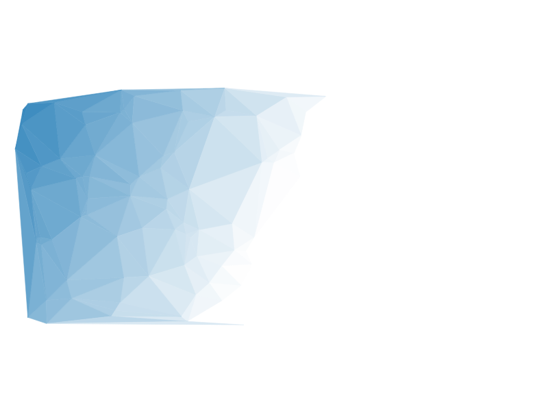

# Tranglify-rs

Tranglify-rs 是一个使用 Rust 语言编写的命令行工具，用于生成类似下面三角形风格的壁纸。



## 使用方法

要使用 Tranglify-rs，您可以在终端中运行以下命令：

```bash
tranglify-rs --width <width> --height <height> --file <filename> --colors <color1,color2,...,colorN>
```

参数解释：

- `--width`：生成壁纸的宽度。默认为 1920 像素。
- `--height`：生成壁纸的高度。默认为 1080 像素。
- `--file`：生成壁纸的文件名。默认为 `wallpaper.png`。
- `--color_be`：用于生成壁纸的开始颜色列表。颜色应用“#”符号表示。例如，`--color_ed #FF0000` 
- `--color_ed`：用于生成壁纸的结束颜色列表。颜色应用“#”符号表示。例如，`--color_ed #FF0000` 

例如，要生成一个 1920*1080 像素的壁纸，颜色为白色和蓝色，并将其保存为 `image.svg` 文件，请运行以下命令：

```bash
tranglify-rs --width 1920 --height 1080 --file generated/image.svg --color_be #2980b9 --color_ed #ffffff
```
```

## 许可证

Tranglify-rs 使用 MIT 许可证发布。请参阅 LICENSE 文件以获取详细信息。
